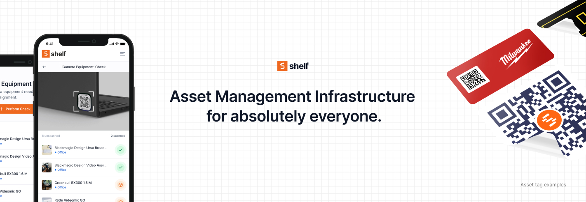

# Shelf.nu

<a href="https://www.shelf.nu/" target="_blank">

</a>

<h4 align="center">
✨ Open Source Asset Management Infrastructure for Everyone ✨
</h4>

<p align="center">
Shelf 🏷️ is a cutting-edge, open-source asset management platform designed to streamline tracking, organizing, and managing assets for individuals, businesses, and educational institutions.
</p>

<div align="center" justify="center">
<a href="https://www.shelf.nu/?ref=github" target="_blank"><b>Website</b></a> •
<a href="https://github.com/Shelf-nu/shelf.nu/tree/main/docs" target="_blank"><b>Documentation</b></a> •
<a href="https://discord.gg/gdPMsSzqCS" target="_blank"><b>Community</b></a> •
<a href="https://twitter.com/ShelfQR/?ref=github" target="_blank"><b>Twitter</b></a> •

[](CODE_OF_CONDUCT.md)

</div>

## Core Features 🚀

- **QR Code Generation & Asset Tags**: Easily assign and track items with QR codes.
- **Location Tracking**: Quickly locate assets using GPS and tagged locations.
- **Team Collaboration**: Seamless collaboration with shared access for teams.
- **Digital Asset Catalog**: Comprehensive, searchable database of all assets.
- **Booking & Reservation Management**: Prevent double bookings and efficiently reserve assets.
- **Remote Access**: Manage your inventory remotely from any location.
- **Custom Fields**: Tailor item details, including purchase history, warranties, and conditions.
- **Insights**: Analyze usage, condition, and other metrics levels at a glance.
- **Instant Search**: Advanced, fast, and intuitive search through all assets.

---

## Real Impact: Eastern Michigan University Case Study 🌟

Shelf revolutionized asset management for Eastern Michigan University's Theatre Program:

- **Centralized Inventory**: Moving from chaotic spreadsheets to an organized digital catalog.
- **Remote Access**: Students coordinate props from different locations, streamlining pre-production.
- **Time Savings**: Eliminated hours of searching through physical stock with remote asset visibility.
- **Collaboration**: Enabled teams to collaborate on asset reservations and planning with ease.

---

## Use Cases 💡

Shelf is ideal for managing:

- **Tool & Equipment Tracking**: For industries needing to oversee large-scale tools or equipment.
- **IT Asset Management**: Track devices, peripherals, and office technology.
- **Theatre & Arts**: Perfect for managing props, costumes, and scenic elements for productions.
- **Home Inventory**: Organize and track personal items, manage warranties, and know their locations.
- **Educational Institutions**: Centralize and manage department assets for **better** collaboration.

---

## Quick Start 🚀

Get Shelf running locally in just a few steps:

### Prerequisites

- **Node.js** (v18 or higher)
- **npm** or **yarn**
- **Git**

### 1. Clone & Install 📦

```bash
git clone https://github.com/Shelf-nu/shelf.nu.git
cd shelf.nu
npm install
```

### 2. Setup Environment Variables 🔧

```bash
cp .env.example .env
```

### 3. Setup Supabase Database 🗄️

You'll need a Supabase account and database. Follow our detailed [Supabase Setup Guide](./docs/supabase-setup.md) to:

- Create your Supabase project
- Configure authentication
- Setup storage buckets
- Get your connection strings and API keys

### 4. Configure Your .env File ⚙️

After completing the Supabase setup, update your `.env` file with the values from your Supabase dashboard.

### 5. Initialize Database 🏗️

```bash
npm run setup
```

### 6. Start Development Server 🎉

```bash
npm run dev
```

Your app will be available at `http://localhost:3000` 🎊

---

## Documentation 📚

- 📖 **[Local Development Guide](./docs/local-development.md)** - Detailed setup for local development
- 🗄️ **[Supabase Setup Guide](./docs/supabase-setup.md)** - Complete Supabase configuration
- 🚀 **[Deployment Guide](./docs/deployment.md)** - Deploy to production (Fly.io, GitHub Actions)
- 🐳 **[Docker Guide](./docs/docker.md)** - Run with Docker
- 🔧 **[All Documentation](./docs/)** - Browse all guides and references

---

## Alternative Setup Options 🛠️

### Docker 🐳

Prefer containers? Check out our [Docker setup guide](./docs/docker.md).

### One-Click Deploy 🚀

Ready for production? See our [deployment guide](./docs/deployment.md) for Fly.io and GitHub Actions setup.

---

## Contributing 🤝

We encourage contributions! See our [contribution guidelines](./CONTRIBUTING.md) to get started.

---

## License 📜

Shelf.nu is licensed under the [AGPL-3.0 License](./LICENSE).

---

<p align="center">
⭐️ Star the repo if you find Shelf helpful!
</p>
