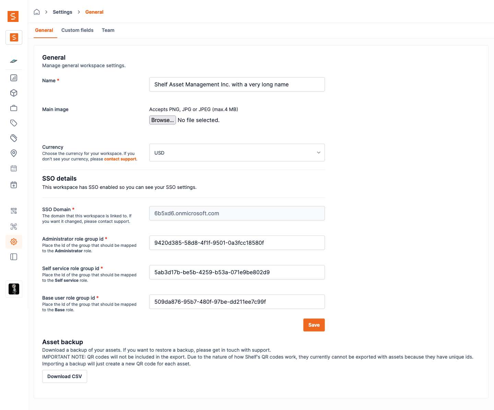

# Set Up SSO with Okta

Shelf supports single sign-on (SSO) with Okta over SAML 2.0. This guide covers the app integration your Okta administrator creates, and how your workspace owner maps your Okta groups to Shelf roles.

## Who does what [#](#who-does-what)

| Who                      | Task                                         | Where                                |
| ------------------------ | -------------------------------------------- | ------------------------------------ |
| Your **Okta admin**      | Create the SAML app and send us its metadata | Okta Admin Console (§1 to §6)        |
| Your **Shelf contact**   | Register your Okta app in Shelf              | Handled by Shelf                     |
| Your **workspace owner** | Map your Okta groups to Shelf roles          | Shelf workspace settings, a GUI (§7) |
| Your **users**           | Sign in                                      | Your Okta login page                 |

Your Okta admin does not need a Shelf account. Everything in §1 to §6 happens inside Okta.

## Prerequisites [#](#prerequisites)

Read the general [SSO prerequisites](../index.md#before-you-start-prerequisites) first, in particular:

- You have a **non-SSO owner account** ready to own the Shelf workspace.
- Any existing **standard accounts** on your SSO domain are ready to be removed.
- You've planned which Okta groups map to which Shelf role (Administrator, Self service, Base).

## 1. Create the app integration [#](#create-app)

In the Okta Admin Console, go to **Applications > Applications** and click **Create App Integration**. Choose **SAML 2.0** and click **Next**.

On the **General Settings** step, enter an app name your users will recognise. We recommend `Shelf`. Click **Next**.

## 2. Service provider (SP) details [#](#sp-details)

On the **Configure SAML** step, fill in the **General** section:

| Okta field                  | Value                                                                |
| --------------------------- | -------------------------------------------------------------------- |
| Single sign-on URL          | `https://nmmqcuiasekdacmhwsxk.supabase.co/auth/v1/sso/saml/acs`      |
| Audience URI (SP Entity ID) | `https://nmmqcuiasekdacmhwsxk.supabase.co/auth/v1/sso/saml/metadata` |
| Default RelayState          | `https://app.shelf.nu/oauthcallback`                                 |
| Name ID format              | `EmailAddress`                                                       |
| Application username        | `Email`                                                              |

Keep **Use this for Recipient URL and Destination URL** checked. Leave the advanced settings (signatures, encryption) on Okta's defaults.

> [!IMPORTANT]
> Shelf identifies a returning user by the SAML `NameID`, so it must stay the same on every login. `EmailAddress` (or `Persistent`) works. Do **not** choose `Transient`: it changes on every login and sign-in fails right after the Okta screen.

## 3. Attribute statements [#](#attribute-statements)

Still on the **Configure SAML** step, add these **attribute statements**. The names must match exactly, because Shelf reads them by name. Leave **Name format** as `Unspecified`.

| Name        | Name format | Value            | Required |
| ----------- | ----------- | ---------------- | -------- |
| `mail`      | Unspecified | `user.email`     | yes      |
| `firstname` | Unspecified | `user.firstName` | yes      |
| `lastname`  | Unspecified | `user.lastName`  | yes      |

> [!NOTE]
> Names are lowercase: `firstname`, not `firstName` or `given_name`. A different spelling is not an error in Okta, but Shelf will not find the value and the user's name stays empty.

## 4. Group attribute statement [#](#group-attribute-statement)

Add one **group attribute statement**. This is how Shelf learns which role each user should get.

| Name     | Name format | Filter                                           |
| -------- | ----------- | ------------------------------------------------ |
| `groups` | Unspecified | e.g. `Starts with` `SSO-Shelf`, or `Contains` it |

How this works:

- **Okta sends group names, not IDs.** Each matching group is sent as its own value of the `groups` attribute, and Shelf reads every one of them, whatever order they come in.
- **The filter only decides which groups leave Okta.** Pick a filter that matches every group you will map in Shelf, and as few others as possible. A shared prefix such as `SSO-Shelf` (`SSO-Shelf-Admins`, `SSO-Shelf-Staff`, `SSO-Shelf-Users`) makes this easy.
- **The filter does not do the matching in Shelf.** Shelf compares each group name you map in §7 to the names Okta sends, in full. `Contains SSO-Shelf` in Okta does not mean `SSO-Shelf` in Shelf matches `SSO-Shelf-Admins`.

Click **Next**, answer the feedback questions as you like, and click **Finish**.

## 5. Assign the app [#](#assign-the-app)

Open the app's **Assignments** tab and assign the groups (or people) who should be able to sign in to Shelf.

> [!IMPORTANT]
> Assignment and the group attribute filter are two separate settings. A user who is in an `SSO-Shelf` group but is **not assigned to the app** is stopped by Okta with "not assigned to this application" and never reaches Shelf. Assigning the same groups you filter on in §4 is the simplest setup.

## 6. Send us your metadata [#](#send-metadata)

Open the app's **Sign On** tab. Under **SAML 2.0**, copy the **Metadata URL**. It looks like `https://your-org.okta.com/app/<app-id>/sso/saml/metadata`.

Send your Shelf contact:

- The **Metadata URL**, or the metadata **XML file** (see below).
- The **domain** your users sign in with (for example `yourcompany.com`).
- The **names of the groups** you plan to map, and which role each should get.

> [!IMPORTANT]
> Shelf must be able to download the Metadata URL from the internet. If your Okta org restricts access by IP or network zone, the URL returns `403 access_denied` to us and we cannot register it. In that case, open the Metadata URL while signed in to Okta (or use the download link next to it), save the XML, and send us the **file** instead.
>
> A file does not update itself. If you rotate the app's signing certificate later, send us the new metadata file **before** switching to the new certificate, or sign-in stops working until we update it.

We register the app and confirm once it's live, usually within **1 business day**. Don't test sign-in until you hear back.

## 7. Map your groups to Shelf roles [#](#map-groups)

Once the app is registered, your **workspace owner** maps each Okta group to a Shelf role in **workspace settings > SSO**.

Enter the **group name** exactly as it appears in Okta next to each role you use:

| Shelf role        | Example Okta group name |
| ----------------- | ----------------------- |
| **Administrator** | `SSO-Shelf-Admins`      |
| **Self service**  | `SSO-Shelf-Staff`       |
| **Base**          | `SSO-Shelf-Users`       |

Rules to know:

- **Use the name, not the Okta group ID.** Okta sends names (this is different from Microsoft Entra, where you paste Object IDs).
- **Multiple groups for one role:** each field accepts several names, separated by commas. Anyone in _any_ of them gets that role.
- **Matching ignores letter case and surrounding spaces**, but is otherwise exact. Copy the name from Okta to be safe.
- **Precedence is Administrator > Self service > Base.** A user whose groups match more than one role gets the highest. A user only ever holds one role per workspace.
- You only need to map the roles you use, but at least one must be mapped. A single group is enough.

## 8. Test single sign-on [#](#test)

Go to `/sso-login`, enter your domain, and sign in as a test user who is assigned to the app:

- A user whose groups match a mapped role lands in the workspace with that role.
- A user with **no matching group** lands on the pending-assignment screen. This is expected, and it resolves as soon as an admin maps their group.

You can also preview what Okta sends: on the **Sign On** tab, click **Preview SAML** (or use the **Preview the SAML assertion** link while editing the SAML settings) and check that `mail`, `firstname`, `lastname` and `groups` are all present.

## Troubleshooting [#](#troubleshooting)

**Okta says the user is not assigned to the application.**
The user is not assigned to the app in Okta. See §5.

**Sign-in fails right after the Okta screen, with no clear error.**
Check the Name ID format (§2). It must be `EmailAddress` or `Persistent`, never `Transient`. Also check that the Single sign-on URL and Audience URI match §2 exactly.

**The user signs in but their name is empty.**
An attribute statement name is misspelled or capitalised differently. It must be `firstname` and `lastname`, all lowercase (§3).

**A user always lands on the pending-assignment screen even though you mapped their group.**
Either the group does not pass the filter in §4 (so Okta never sends it), or the name pasted in Shelf differs from the Okta group name. Preview the SAML assertion for that user (§8) and paste the exact value you see under `groups`.

**We report that your Metadata URL returns 403.**
Your Okta org blocks the metadata endpoint for requests from outside your network. Send us the metadata XML file instead (§6).
