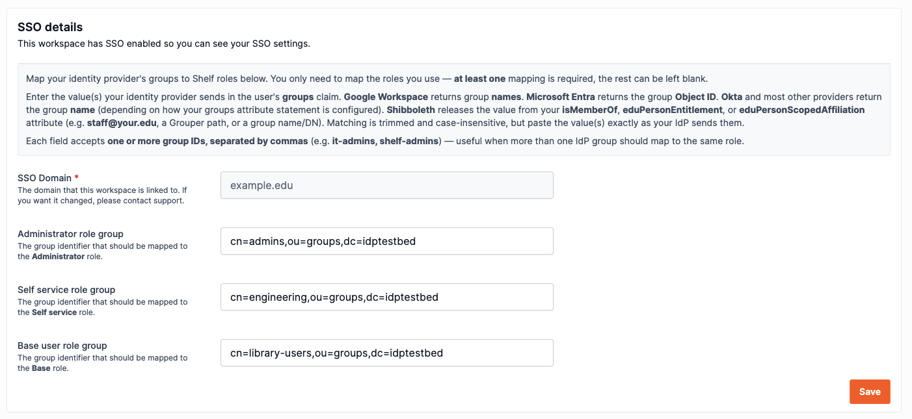

# Set Up SSO with Shibboleth

Shelf supports SSO with Shibboleth over SAML 2.0. This guide covers the Shelf-specific configuration your identity team adds to your IdP, and how your workspace owner maps your groups to Shelf roles.

## Who does what [#](#who-does-what)

| Who                          | Task                                          | Where                                |
| ---------------------------- | --------------------------------------------- | ------------------------------------ |
| Your **identity / IdP team** | Trust Shelf's SP and release attributes       | Shibboleth XML config (§1–§6)        |
| Your **Shelf contact**       | Register your IdP in Shelf, enable encryption | Handled by Shelf                     |
| Your **workspace owner**     | Map released groups to Shelf roles            | Shelf workspace settings, a GUI (§7) |
| Your **users**               | Sign in                                       | Your Shibboleth login page           |

## Prerequisites [#](#prerequisites)

Read the general [SSO prerequisites](../index.md#before-you-start-prerequisites) first — in particular:

- You have a **non-SSO owner account** ready to own the Shelf workspace.
- Any existing **standard accounts** on your SSO domain are ready to be removed.
- You've planned which of your groups/affiliations map to which Shelf role (Administrator, Self service, Base).

## 1. Service provider (SP) details [#](#service-provider-sp-details)

Register these Shelf SP values in your `metadata-providers.xml`:

| Detail                   | Value                                                                |
| ------------------------ | -------------------------------------------------------------------- |
| ACS URL                  | `https://nmmqcuiasekdacmhwsxk.supabase.co/auth/v1/sso/saml/acs`      |
| Entity ID / Metadata URL | `https://nmmqcuiasekdacmhwsxk.supabase.co/auth/v1/sso/saml/metadata` |
| Relay State              | `https://app.shelf.nu/oauthcallback`                                 |

> [!NOTE]
> Shelf's SP metadata is a live URL, so add it as an `HTTPMetadataProvider` (or download it once as a `FilesystemMetadataProvider`).

```xml
<!-- conf/metadata-providers.xml (excerpt) -->
<MetadataProvider id="ShelfSP" xsi:type="HTTPMetadataProvider"
    metadataURL="https://nmmqcuiasekdacmhwsxk.supabase.co/auth/v1/sso/saml/metadata" />
```

## 2. Configure a persistent NameID (required) [#](#persistent-nameid-required)

Shelf identifies a returning user by the SAML `NameID`. Shibboleth's default is `transient`, which changes on every login — Shelf **rejects** it, and sign-in fails immediately after authentication. Configure a **`persistent`** NameID for the Shelf relying party (`emailAddress` is also accepted).

```xml
<!-- conf/saml-nameid.xml -->
<util:list id="shibboleth.saml2.NameIDFormatPrecedence">
    <value>urn:oasis:names:tc:SAML:2.0:nameid-format:persistent</value>
</util:list>
```

```xml
<!-- conf/relying-party.xml (excerpt) — pin persistent for the Shelf SP -->
<util:list id="shibboleth.RelyingPartyOverrides">
    <bean parent="RelyingPartyByName"
          c:relyingPartyIds="#{ {'https://nmmqcuiasekdacmhwsxk.supabase.co/auth/v1/sso/saml/metadata'} }">
        <property name="profileConfigurations">
            <list>
                <bean parent="SAML2.SSO"
                      p:nameIDFormatPrecedence="#{ {'urn:oasis:names:tc:SAML:2.0:nameid-format:persistent'} }" />
            </list>
        </bean>
    </bean>
</util:list>
```

> [!IMPORTANT]
> If you skip this, users reach the login screen but sign-in fails right afterward. If everything else checks out and login still fails at that point, this is almost always why.

## 3. Release the required attributes [#](#release-attributes)

Add an `AttributeFilterPolicy` scoped to Shelf's entity ID, releasing `mail`, `givenName`, `sn`, and your chosen group attribute (see §6). Without a release policy the assertion is empty and sign-in fails with "no email".

```xml
<!-- conf/attribute-filter.xml (excerpt) — Shibboleth IdP v5 -->
<AttributeFilterPolicyGroup id="ShelfPolicy"
    xmlns="urn:mace:shibboleth:2.0:afp"
    xmlns:xsi="http://www.w3.org/2001/XMLSchema-instance"
    xsi:schemaLocation="urn:mace:shibboleth:2.0:afp http://shibboleth.net/schema/idp/shibboleth-afp.xsd">

  <AttributeFilterPolicy id="releaseToShelf">
    <PolicyRequirementRule xsi:type="Requester"
        value="https://nmmqcuiasekdacmhwsxk.supabase.co/auth/v1/sso/saml/metadata" />

    <AttributeRule attributeID="mail"><PermitValueRule xsi:type="ANY" /></AttributeRule>
    <AttributeRule attributeID="givenName"><PermitValueRule xsi:type="ANY" /></AttributeRule>
    <AttributeRule attributeID="sn"><PermitValueRule xsi:type="ANY" /></AttributeRule>
    <AttributeRule attributeID="isMemberOf"><PermitValueRule xsi:type="ANY" /></AttributeRule>
  </AttributeFilterPolicy>
</AttributeFilterPolicyGroup>
```

> [!NOTE]
> On v5, SAML encoding lives in the attribute registry (`conf/attributes/`) — `mail`, `givenName`, `sn`, `eduPersonScopedAffiliation`, and `eduPersonEntitlement` ship pre-registered. `isMemberOf` (eduMember schema) may need its own registry rule if your deployment doesn't already release it.

## 4. Assertion encryption — automatic [#](#assertion-encryption)

Shelf publishes an encryption certificate in its metadata and accepts encrypted assertions, so your IdP encrypts automatically (Shibboleth's default when the SP advertises an encryption key). Nothing to configure — assertions are encrypted end-to-end.

## 5. Send us your metadata [#](#send-metadata)

Send your Shelf contact:

- Your **IdP metadata** — the metadata URL (e.g. `https://idp.your.edu/idp/shibboleth`, or your federation metadata) or an exported XML file.
- The **domain** your users sign in with.
- Which **group strategy** you chose (§6).

We register the provider and confirm once it's live — usually about **1 business day**. Don't test sign-in until you hear back.

## 6. Choose a group strategy [#](#group-strategy)

Shelf assigns roles from the group values you release. Pick whichever your institution already populates — all three work identically on the Shelf side; you only need one.

| Strategy                       | SAML Name (OID)                    | Example value                                                                         |
| ------------------------------ | ---------------------------------- | ------------------------------------------------------------------------------------- |
| **`isMemberOf`** (recommended) | `urn:oid:1.3.6.1.4.1.5923.1.5.1.1` | `cn=shelf-admins,ou=groups,dc=your,dc=edu` or a Grouper path `your:apps:shelf:admins` |
| `eduPersonEntitlement`         | `urn:oid:1.3.6.1.4.1.5923.1.1.1.7` | `urn:mace:your.edu:shelf:admin`                                                       |
| `eduPersonScopedAffiliation`   | `urn:oid:1.3.6.1.4.1.5923.1.1.1.9` | `staff@your.edu`, `faculty@your.edu`                                                  |

- **`isMemberOf`** — best when you can create dedicated Shelf groups in Grouper/LDAP. The most flexible.
- **`eduPersonEntitlement`** — application-specific entitlement URIs.
- **`eduPersonScopedAffiliation`** — coarse mapping by affiliation (e.g. all `staff` → one role). No new groups needed.

Whichever you pick, release it via the `attribute-filter.xml` policy in §3 (swap `isMemberOf` for your attribute id), and tell your Shelf contact so we point the mapping at the right OID.

## 7. Map your groups to Shelf roles [#](#map-groups)

Once your provider is registered, your **workspace owner** maps each group value to a Shelf role in **workspace settings → SSO**.



Enter the value your IdP releases next to each role you use:

| Shelf role        | Paste the group value that should grant it      |
| ----------------- | ----------------------------------------------- |
| **Administrator** | e.g. `cn=shelf-admins,ou=groups,dc=your,dc=edu` |
| **Self service**  | e.g. `cn=shelf-staff,ou=groups,dc=your,dc=edu`  |
| **Base**          | e.g. `cn=shelf-users,ou=groups,dc=your,dc=edu`  |

Rules to know:

- **Paste the value exactly** as your IdP releases it. If unsure, ask your identity team for a sample assertion (or check the IdP audit log) for the precise string.
- **Multiple groups → one role:** each field accepts **several values, comma-separated** (e.g. Grouper paths `your:apps:shelf:it-staff, your:apps:shelf:av-services`) — anyone in _any_ of them gets that role. Note: a value that itself contains commas (a full LDAP **DN** like `cn=…,ou=…,dc=…`) can only be used **on its own**, not comma-listed — to grant one role from several DN-shaped groups, release a comma-free identifier (a Grouper path or an `eduPersonEntitlement`) for them instead.
- **Matching is trimmed and case-insensitive** — but a leading/trailing scope difference still counts as a mismatch, so copy the real value.
- **Precedence is Administrator > Self service > Base.** A user whose groups match more than one role gets the highest. A user still only ever holds one role per workspace.
- Users can be members of **many** groups — Shelf matches any mapped one regardless of its position in the list. You only need to map the roles you actually use, but at least one must be mapped.

## 8. Test single sign-on [#](#test)

Go to `/sso-login`, enter your domain, and sign in as a test user:

- A user whose groups match a mapped role lands in the workspace with that role.
- A user with **no matching group** lands on the pending-assignment screen (expected) rather than being denied — it resolves as soon as an admin maps their group.

## Troubleshooting [#](#troubleshooting)

**No email, or missing name/groups after a successful redirect back from Shibboleth.**
Almost always a missing or mis-scoped `attribute-filter.xml` policy — the resolver may have the value, but nothing is released until a filter policy permits it to Shelf's entity ID. Check §3 first.

**Login fails immediately after the Shibboleth screen, with no clear error.**
Your IdP is issuing a `transient` NameID (the default). It must be `persistent` (or `emailAddress`) for the Shelf relying party — see §2.

**A user always lands on the pending-assignment screen even though you mapped their group.**
The string the IdP released doesn't match what's pasted in Shelf. Matching is case-insensitive and trimmed, but not fuzzy. Get a sample assertion for that user and paste the exact value.
