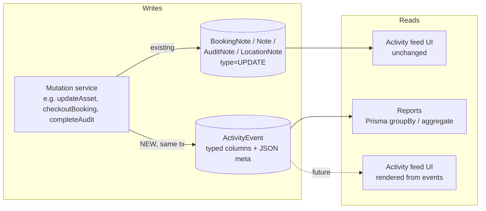

# Redesign: Structured Activity Tracking

## Context

The current system records every tracked change (asset updated, booking status
changed, audit started, custody assigned, etc.) as a Markdoc-wrapped human
sentence inserted into the existing `Note` / `BookingNote` / `AuditNote` /
`LocationNote` tables with `type = UPDATE`. Example row content:

```
 changed the asset value from $100 to $200.
```

That's fine for rendering the per-entity "Activity" feed. It is **not** fine
as a data source for reports:

- Generating reports means regex-parsing this text (as `note-sanitizer.server.ts`
  already does for CSV export). Copy changes break every consumer.
- Comments and system events share the same table, so querying "events" means
  filtering on `type = UPDATE` plus per-call-site string patterns.
- There are no typed `actor`, `action`, `entityType`, `from`, `to` columns, so
  aggregation queries (`groupBy`, `count`, duration math) require loading rows
  and parsing in Node.
- Each entity has its own note table, so cross-entity queries ("all activity
  by user X this week across assets, bookings, audits") need 4 unions.

**Goal of this redesign:** introduce a single, properly structured activity
stream, start recording events fresh (no historical backfill), and use it to
power reports. Keep the existing activity feed UI working unchanged — no
regressions for end users. A later PR can migrate the feed to render from the
new stream and retire the `UPDATE`-type note writes.

## Shape of the change



Every existing system-note creation site gains a sibling call to
`recordEvent(...)` within the **same Prisma transaction** where one exists, so
the event row and the mutation are atomic. User-authored `COMMENT` notes are
untouched and don't get events.

## Schema additions (`packages/database/prisma/schema.prisma`)

New model, enums, and org relation. Name is `ActivityEvent` to avoid colliding
with the existing `AuditSession` / `Audit*` vocabulary.

```prisma
model ActivityEvent {
  id             String         @id @default(cuid())
  organizationId String
  occurredAt     DateTime       @default(now()) @db.Timestamptz(3)

  // Who
  actorUserId    String?
  actorSnapshot  Json?          // { firstName, lastName, displayName } captured at write time
                                // (robust against user deletion / rename for reports)

  // What
  action         ActivityAction
  entityType     ActivityEntity
  entityId       String         // primary entity this event is "about"

  // Cross-refs — sparse, populate whichever apply. Plain FKs (no relation)
  // to keep the table independent of cascade rules on the source entities.
  assetId        String?
  bookingId      String?
  auditSessionId String?
  auditAssetId   String?
  kitId          String?
  locationId     String?
  teamMemberId   String?
  targetUserId   String?        // e.g. custody assignee, audit assignee

  // Typed field-change payload (optional — used by *_CHANGED actions)
  field          String?        // e.g. "valuation", "status", "name"
  fromValue      Json?
  toValue        Json?

  // Action-specific extras (e.g. { skippedCount, assetIds, imageIds })
  meta           Json?

  organization   Organization   @relation(fields: [organizationId], references: [id], onDelete: Cascade, onUpdate: Cascade)

  // Reports-oriented indexes — keep tight; schema reviewer will push back on
  // a wide index set.
  @@index([organizationId, occurredAt])
  @@index([organizationId, action, occurredAt])
  @@index([organizationId, entityType, entityId, occurredAt])
  @@index([actorUserId, occurredAt])
  @@index([assetId, occurredAt])
  @@index([bookingId, occurredAt])
  @@index([auditSessionId, occurredAt])
}

enum ActivityEntity {
  ASSET
  BOOKING
  AUDIT
  KIT
  LOCATION
  TEAM_MEMBER
  CUSTODY
  USER
  ORGANIZATION
}

enum ActivityAction {
  // Asset
  ASSET_CREATED
  ASSET_NAME_CHANGED
  ASSET_DESCRIPTION_CHANGED
  ASSET_CATEGORY_CHANGED
  ASSET_KIT_CHANGED
  ASSET_LOCATION_CHANGED
  ASSET_TAGS_CHANGED
  ASSET_STATUS_CHANGED
  ASSET_VALUATION_CHANGED
  ASSET_CUSTOM_FIELD_CHANGED
  ASSET_ARCHIVED
  ASSET_DELETED

  // Custody
  CUSTODY_ASSIGNED
  CUSTODY_RELEASED

  // Booking
  BOOKING_CREATED
  BOOKING_STATUS_CHANGED
  BOOKING_DATES_CHANGED
  BOOKING_ASSETS_ADDED
  BOOKING_ASSETS_REMOVED
  BOOKING_CHECKED_OUT
  BOOKING_CHECKED_IN
  BOOKING_PARTIAL_CHECKIN
  BOOKING_CANCELLED
  BOOKING_ARCHIVED

  // Audit
  AUDIT_CREATED
  AUDIT_STARTED
  AUDIT_ASSETS_ADDED
  AUDIT_ASSETS_REMOVED
  AUDIT_ASSET_SCANNED
  AUDIT_ASSET_SCAN_REMOVED
  AUDIT_DUE_DATE_CHANGED
  AUDIT_ASSIGNEE_ADDED
  AUDIT_ASSIGNEE_REMOVED
  AUDIT_UPDATED
  AUDIT_COMPLETED
  AUDIT_CANCELLED
  AUDIT_ARCHIVED

  // Location
  LOCATION_CREATED
  LOCATION_UPDATED

  // Kit
  KIT_CREATED
  KIT_UPDATED
}

// Add reverse relation on Organization
model Organization {
  // ...existing fields...
  activityEvents ActivityEvent[]
}
```

Migration: single `pnpm db:prepare-migration --name add_activity_event`, no
data backfill.

## Service module (`apps/webapp/app/modules/activity-event/`)

New module, co-located with the rest of `app/modules/`.

```
apps/webapp/app/modules/activity-event/
├── service.server.ts       // recordEvent + typed helpers, tx-aware
├── service.server.test.ts
├── reports.server.ts       // report queries (see below)
├── reports.server.test.ts
└── types.ts                // EventInput, per-action payload shapes
```

`service.server.ts` exports:

```ts
/**
 * Persist a single activity event. Pass `tx` when called inside an
 * interactive transaction so the event commits atomically with the
 * mutation; omit for fire-and-forget writes.
 */
export async function recordEvent(
  input: ActivityEventInput,
  tx?: Prisma.TransactionClient
): Promise<void>;

/**
 * Bulk variant for operations like BOOKING_ASSETS_ADDED where we want one
 * row per asset (cheaper aggregation later).
 */
export async function recordEvents(
  inputs: ActivityEventInput[],
  tx?: Prisma.TransactionClient
): Promise<void>;
```

`ActivityEventInput` is a discriminated union per `ActivityAction`, so the
compiler forces callers to supply the right cross-refs and `from/to/meta`
shape. This is the structural guarantee we don't have today.

`actorSnapshot` is always filled at write time from a small helper that
reuses `loadUserForNotes` where available (cheap, already memoized per
request).

## Integration points (where `recordEvent` gets added)

These are the files that currently write UPDATE notes. We add a sibling
`recordEvent` call next to each, **inside the same transaction** when the
mutation already runs in one. No note call gets removed.

| File                                                                                                                                                                                             | Actions recorded                                                                                                                                                                                                                                                                       |
| ------------------------------------------------------------------------------------------------------------------------------------------------------------------------------------------------ | -------------------------------------------------------------------------------------------------------------------------------------------------------------------------------------------------------------------------------------------------------------------------------------- |
| `apps/webapp/app/modules/asset/service.server.ts`                                                                                                                                                | `ASSET_CREATED`, `ASSET_NAME_CHANGED`, `ASSET_DESCRIPTION_CHANGED`, `ASSET_CATEGORY_CHANGED`, `ASSET_VALUATION_CHANGED`, `ASSET_LOCATION_CHANGED`, `ASSET_TAGS_CHANGED`, `ASSET_STATUS_CHANGED`, `ASSET_CUSTOM_FIELD_CHANGED`, `ASSET_ARCHIVED`, `ASSET_DELETED`                       |
| `apps/webapp/app/modules/kit/service.server.ts`                                                                                                                                                  | `KIT_CREATED`, `KIT_UPDATED`, `ASSET_KIT_CHANGED` (via `createBulkKitChangeNotes` / `createKitChangeNote`)                                                                                                                                                                             |
| `apps/webapp/app/modules/booking/service.server.ts`                                                                                                                                              | Every `bookingNote.create({...})` call at lines 1690, 2050, 2068, 2220, 2287, 2716, 3272, 3299, 3313, 3324, 4347, 4361, 4372, 4388, 4417 — maps to `BOOKING_*` actions                                                                                                                 |
| `apps/webapp/app/modules/audit/service.server.ts` + `helpers.server.ts`                                                                                                                          | `AUDIT_CREATED`, `AUDIT_STARTED`, `AUDIT_ASSET_SCANNED`, `AUDIT_ASSET_SCAN_REMOVED`, `AUDIT_COMPLETED`, `AUDIT_UPDATED`, `AUDIT_DUE_DATE_CHANGED`, `AUDIT_ASSIGNEE_ADDED`, `AUDIT_ASSIGNEE_REMOVED`, `AUDIT_ASSETS_ADDED`, `AUDIT_ASSETS_REMOVED`, `AUDIT_CANCELLED`, `AUDIT_ARCHIVED` |
| `apps/webapp/app/modules/location/service.server.ts` + `modules/location-note/service.server.ts`                                                                                                 | `LOCATION_CREATED`, `LOCATION_UPDATED`                                                                                                                                                                                                                                                 |
| Custody routes: `assets.$assetId.overview.assign-custody.tsx`, `assets.$assetId.overview.release-custody.tsx`, `kits.$kitId.assets.assign-custody.tsx`, `kits.$kitId.assets.release-custody.tsx` | `CUSTODY_ASSIGNED`, `CUSTODY_RELEASED`                                                                                                                                                                                                                                                 |
| `apps/webapp/app/modules/scan/service.server.ts`                                                                                                                                                 | `AUDIT_ASSET_SCANNED` (already routes through audit helpers; verify)                                                                                                                                                                                                                   |
| `apps/webapp/app/modules/asset-reminder/worker.server.ts`                                                                                                                                        | whatever events the reminder worker currently notes (optional, low priority)                                                                                                                                                                                                           |

Pattern at each call site (audit example):

```ts
// existing
await createAssetScanNote({ auditSessionId, assetId, userId, isExpected, tx });

// added
await recordEvent(
  {
    organizationId,
    actorUserId: userId,
    action: "AUDIT_ASSET_SCANNED",
    entityType: "AUDIT",
    entityId: auditSessionId,
    auditSessionId,
    auditAssetId,
    assetId,
    meta: { isExpected },
  },
  tx
);
```

Reuse `resolveUserLink` / `loadUserForNotes` from `modules/note/helpers.server.ts`
to populate `actorSnapshot` — no duplicate user fetches.

## Reports module (`apps/webapp/app/modules/activity-event/reports.server.ts`)

Each report is a single Prisma query, organization-scoped, with a
`{ from, to }` window. Example shapes (one per domain):

**Asset change history**

```ts
export function assetChangeHistory({ organizationId, assetId, from, to });
// db.activityEvent.findMany({
//   where: { organizationId, assetId, occurredAt: { gte: from, lte: to },
//            action: { startsWith: "ASSET_" } },
//   orderBy: { occurredAt: "desc" } });
```

**Custody / utilization**

```ts
export function custodyDurationsByAsset({ organizationId, from, to });
// Pairs CUSTODY_ASSIGNED with the matching CUSTODY_RELEASED (or booking
// checkout/checkin) using a window function in raw SQL, returns
// { assetId, custodianId, heldFrom, heldTo, durationSeconds }[].
```

**Booking lifecycle**

```ts
export function bookingStatusTransitionCounts({ organizationId, from, to });
// db.activityEvent.groupBy({
//   by: ["toValue"],
//   where: { organizationId, action: "BOOKING_STATUS_CHANGED",
//            occurredAt: { gte: from, lte: to } },
//   _count: true });
```

**Audit outcomes**

```ts
export function auditCompletionStats({ organizationId, from, to });
// db.activityEvent.findMany({
//   where: { organizationId, action: "AUDIT_COMPLETED",
//            occurredAt: { gte: from, lte: to } },
//   select: { auditSessionId: true, actorUserId: true, meta: true,
//             occurredAt: true } });
// meta holds { expectedCount, foundCount, missingCount, unexpectedCount }
```

All four reports run with indexed columns; no content parsing anywhere.

## Historical data

Not migrated. `occurredAt >= deployment_time` is the contract. The UI
activity feed still shows the pre-rollout history from the Note tables; the
reports show post-rollout data only and state the start date in the UI.

## Critical files to create / modify

Create:

- `packages/database/prisma/schema.prisma` (add model + enums + `Organization.activityEvents`)
- `packages/database/prisma/migrations/<ts>_add_activity_event/migration.sql` (generated)
- `apps/webapp/app/modules/activity-event/service.server.ts`
- `apps/webapp/app/modules/activity-event/reports.server.ts`
- `apps/webapp/app/modules/activity-event/types.ts`
- `apps/webapp/app/modules/activity-event/service.server.test.ts`
- `apps/webapp/app/modules/activity-event/reports.server.test.ts`

Modify (add `recordEvent` calls alongside existing note writes):

- `apps/webapp/app/modules/asset/service.server.ts`
- `apps/webapp/app/modules/kit/service.server.ts`
- `apps/webapp/app/modules/booking/service.server.ts`
- `apps/webapp/app/modules/audit/service.server.ts`
- `apps/webapp/app/modules/audit/helpers.server.ts`
- `apps/webapp/app/modules/location/service.server.ts`
- `apps/webapp/app/modules/location-note/service.server.ts`
- `apps/webapp/app/modules/scan/service.server.ts`
- The custody routes listed in the integration table

Reuse:

- `resolveUserLink` and `loadUserForNotes` from `apps/webapp/app/modules/note/helpers.server.ts`
  for `actorSnapshot` (avoid re-fetching users).
- The `tx: Prisma.TransactionClient` pattern already used in
  `apps/webapp/app/modules/audit/helpers.server.ts`.

## Implementation order

1. Schema + migration + regenerate Prisma client.
2. `activity-event` module: `types.ts`, `service.server.ts` with tests.
3. `reports.server.ts` with tests (stub integration callers as needed).
4. Wire `recordEvent` into asset module, run tests.
5. Wire into kit, custody routes.
6. Wire into booking service (largest set of call sites — do in one pass,
   grouped by status-transition helpers to keep the diff reviewable).
7. Wire into audit service + helpers.
8. Wire into location / scan.
9. `pnpm webapp:validate`.

## Verification

- **Unit**: tests for `recordEvent` (tx rollback rolls event back; snapshot
  captured) and each report (happy-path + empty-range + multi-org isolation).
- **Integration**: after step 4, manually update an asset locally, confirm
  one `ActivityEvent` row per changed field in `psql` with correct
  `fromValue`/`toValue`/`actorSnapshot`.
- **End-to-end**: checkout a booking end-to-end (`DRAFT → RESERVED →
ONGOING → COMPLETE`), confirm 3 `BOOKING_STATUS_CHANGED` rows + 1
  `BOOKING_CHECKED_OUT` + 1 `BOOKING_CHECKED_IN`, and that the existing
  activity feed still renders identically (no UI regression).
- **Reports**: run each of the four example queries against the seeded
  fixture dataset, verify counts match the events recorded during the
  test run.
- **Typecheck / lint / tests**: `pnpm webapp:validate`.
